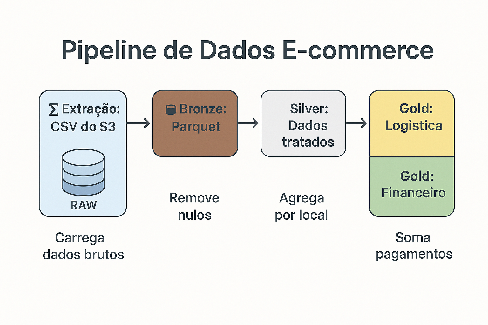

## Pipeline de Dados E-commerce

<p align="center">
  
</p>


## 📌 Visão Geral

Pipeline de dados para processamento de informações de e-commerce, implementando um fluxo ELT (Extract, Load, Transform) com:
- Extração de dados brutos (RAW)
- Processamento para camada Bronze (dados crus)
- Transformação para camada Silver (dados limpos e tratados)
- Agregações para camada Gold (dados analíticos)

## 📋 Funcionalidades

- `Extração`: Carrega dados CSV do S3 para a camada Bronze em formato Parquet
- `Transformação Bronze→Silver`: 
  - Filtra pedidos com status "delivered"
  - Remove valores nulos
- `Transformação Silver→Gold`:
  - **Logística**: Agrega pedidos por estado/cidade
  - **Financeiro**: Calcula valor total por cliente

## 🛠 Tecnologias Utilizadas

- **Apache Airflow**: Orquestração do pipeline
- **AWS S3**: Armazenamento de dados
- **PyArrow/Parquet**: Formato de arquivo columnar
- **Pandas**: Processamento de dados
- **Python 3**: Linguagem principal

## 🏗 Estrutura do Projeto
- 📁 **DNC-DATA-ENGINEER/**
  - 📁 `airflow/` - _Configurações do Airflow_
  - 📁 `app/` - _Código fonte_
    - 📄 `extractor_loader.py` - Extração RAW→Bronze
    - 📄 `transformer.py` - Transformações Bronze→Silver→Gold
  - 📁 `dags/` - _DAGs do Airflow_
    - 📄 `orders_dag.py` - Pipeline principal
  - 📁 `config/` - _Arquivos de configuração_
  - 📁 `datasources/` - _Notebooks de exploração_
  - 📁 `input-data/` - _Dados de exemplo locais_
  - 📄 `docker-compose.yaml` - _Configuração do Airflow_
  - 📄 `.env` - _Variáveis de ambiente_
  - 
### 📊 Diagrama de Fluxo
```mermaid
graph TD
    A[📥 Extract: CSV do S3] -->|Carrega dados brutos| B[🟤 Bronze: Parquet]
    B -->|Remove nulos| C[⚪ Silver: Dados tratados]
    C -->|Agrega por local| D[🟡 Gold: Logística]
    C -->|Soma pagamentos| E[🟢 Gold: Financeiro]
